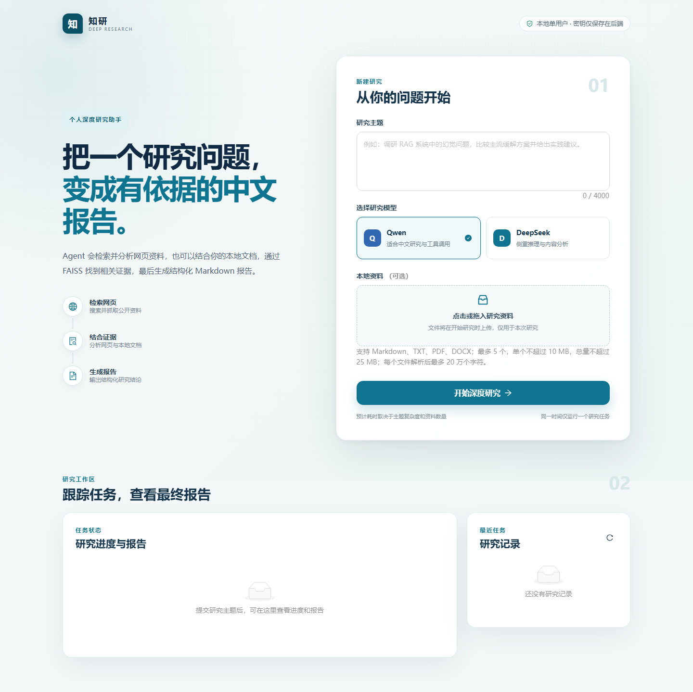

# 深度研究智能体

一个意在提升个人研究效率的个人项目，也是一个为研究课题提供初始方向并生成初始报告的 Agent 研究助手。

用户输入研究主题并可选提供本地资料后，工具型 Agent 会搜索、抓取和分析网页内容，再生成中文 Markdown 研究报告。项目重点展示 Agent 工具调用、Qwen／DeepSeek 模型路由、网页研究、FAISS 本地 RAG，以及稳定 Web 交互的完整闭环。

## 项目定位

- 单个用户在本地或个人演示环境运行
- 输入一个研究主题
- 可选择 Qwen 或 DeepSeek
- 可选上传本地文档作为补充证据
- Agent 调用搜索、抓取、分析和报告工具
- 在浏览器中查看任务状态并下载最终报告
- 页面刷新后可恢复最近任务和已完成报告

项目不是通用 AI 平台。首版不实现用户系统、多租户、Redis、Celery、WebSocket、微服务或高并发部署。

## 当前状态

已完成：

- 动态研究主题输入
- Qwen／DeepSeek 聊天模型切换
- 独立 Embedding 配置和备用模型降级
- 工具型 Agent、网页研究和报告生成
- 本地文档解析、切分、内容哈希去重和不可信证据隔离
- Markdown／TXT／PDF／DOCX 真实解析校验、30 秒超时和 Markdown 缓存
- Qwen Embedding、FAISS Top-K 4 检索与索引落盘
- 命令行通过多个 `--file` 使用本地文档 RAG
- 命令行与后续 FastAPI 共用的异步研究运行入口
- 结构化研究结果、真实阶段回调、协作式取消和稳定错误处理
- 优先返回 Reporter 实际生成的 Markdown 报告文件
- FastAPI 健康检查、文件、任务、取消、历史和报告接口
- SQLAlchemy 2 + SQLite 任务、文件和报告元数据持久化
- 单进程单活动任务管理、启动恢复和关闭中断处理
- 安全文件名、扩展名、空文件和大小限制
- React + TypeScript + Vite 单页研究输入界面
- Ant Design 主题表单、Qwen／DeepSeek 选择和响应式布局
- 可选资料上传、任务创建、重复提交保护和中文错误反馈
- 1.5 秒任务状态轮询、协作式取消与异常自动暂停
- 最近 8 个任务、刷新恢复、运行时间与安全错误展示
- react-markdown 安全报告预览和 Markdown 下载
- 任务详情中的 RAG 启用状态和实际资料文件名
- P1-M1 全仓 Ruff 规范清理
- P1-M2a 至 P1-M2d 高价值类型修复

W0 至 W6 已全部完成：稳定 Web 界面、真实格式本地 RAG、单端口生产启动、离线质量门禁、演示说明和架构文档已经形成闭环。项目进入可演示、可复现状态，主体功能不再扩张。

## 目标技术栈

| 层次 | 技术 | 用途 |
| --- | --- | --- |
| 研究核心 | Python 3.10、AsyncIO | Agent 主程序、模型与异步工具调用 |
| 后端 | FastAPI、Uvicorn、Pydantic v2 | 文件上传、研究任务、状态、取消与报告接口 |
| 元数据 | SQLite、SQLAlchemy 2 | 保存任务、文件和报告元数据，支持刷新恢复 |
| 前端 | React、TypeScript、Vite | 稳定的单页用户界面 |
| 组件 | Ant Design | 表单、上传、状态反馈和响应式布局 |
| 报告展示 | react-markdown | 安全展示 Markdown，不启用原始 HTML |
| 配置 | MMEngine Config、python-dotenv | 配置合并和本地密钥读取 |
| 大模型 | Qwen、DeepSeek、OpenAI 兼容接口 | 工具调用、分析和报告生成 |
| 网页研究 | Crawl4AI、DDGS、HTTPX | 网页搜索、抓取和解析 |
| 本地 RAG | FAISS、Qwen Embedding | 本地文档向量索引与 Top-K 检索 |
| 质量检查 | pytest、Ruff、mypy、前端类型检查与组件测试 | 离线验证后端与关键交互 |

FastAPI、SQLite、单进程任务管理以及 React、Vite、Ant Design 单页界面均已落地。现有 Agent、命令行、本地 RAG、后端接口、任务闭环和报告页面均可运行。

## 目标架构

```text
React + TypeScript 单页界面
  ├─ 研究主题与模型选择
  ├─ 可选文档上传
  ├─ 状态轮询与任务取消
  └─ Markdown 报告查看与下载
                ↓ HTTP
FastAPI + 单进程 AsyncIO 任务管理
  ├─ Pydantic 输入校验
  ├─ SQLite 任务元数据
  └─ 研究运行入口
                ↓
工具型 Agent
  ├─ 网页搜索、抓取与分析
  ├─ 本地文档 → 切分 → Embedding → FAISS Top-K
  └─ 中文 Markdown 报告
```

首版使用 1 至 2 秒 HTTP 轮询，不使用 SSE 或 WebSocket；同一时间只执行一个研究任务。SQLite 负责界面状态恢复，FAISS 负责文档向量检索。

## 当前项目结构

```text
configs/       研究场景与模型配置
docs/          项目范围、技术需求和开发计划
examples/      当前命令行入口
frontend/      React、TypeScript、Vite 单页前端
scripts/       单端口生产启动脚本
src/
  api/         FastAPI、SQLite 和单任务管理
  application/ 研究输入、阶段和结果模型
  research_runner.py 命令行与后续 API 共用的异步研究入口
  document_retriever.py 本地文档切分与 FAISS 检索
  agent/       工具型 Agent 执行循环
  model/       Qwen／DeepSeek 等模型适配与降级
  tool/        搜索、文档分析和报告工具
  environment/ 文件系统与 FAISS 检索
  memory/      研究过程会话记忆
  prompt/      工具调用提示模板
tests/         离线测试
```

前端通过 HTTP 复用现有 FastAPI 和研究核心，不会另建一套 Agent 或 RAG。

## 界面预览



## 从零开始运行

推荐使用 Python 3.10、Node.js 20.19 以上兼容版本和 pnpm。先安装开发环境所需依赖：

```powershell
python -m pip install -r requirements-dev.txt
Copy-Item .env.template .env
Set-Location frontend
pnpm install
Set-Location ..
```

随后编辑项目根目录的 `.env`，至少填写准备使用的聊天模型密钥；如果需要本地 RAG，还要填写 Embedding 模型密钥。

生产演示只需一个命令：

```powershell
python scripts/start_web.py
```

脚本会在当前环境可以找到 pnpm 时先生成前端生产构建，再由 FastAPI 同时托管页面和 API。如果 PyCharm 的运行环境找不到 pnpm，或 pnpm 无法调用 Node.js，但 `frontend/dist` 已经存在，脚本会自动复用现有构建。浏览器打开 `http://127.0.0.1:8000`，接口文档仍位于 `http://127.0.0.1:8000/docs`。

只安装运行依赖而不执行测试时，可改用 `requirements.txt`。

## 配置模型

复制 `.env.template` 为 `.env`，密钥只保存在本地，不得提交到 GitHub。

默认使用 Qwen：

```env
MODEL_PROVIDER=qwen
MODEL_NAME=qwen3-max
EMBEDDING_PROVIDER=qwen
EMBEDDING_MODEL=text-embedding-v4
DASHSCOPE_API_KEY=你的密钥
```

切换到 DeepSeek 时，聊天模型使用 DeepSeek，FAISS 仍可使用 Qwen Embedding：

```env
MODEL_PROVIDER=deepseek
MODEL_NAME=deepseek-v4-flash
DEEPSEEK_API_KEY=你的密钥

EMBEDDING_PROVIDER=qwen
EMBEDDING_MODEL=text-embedding-v4
DASHSCOPE_API_KEY=你的密钥
```

模型标识可能随提供方更新，请以实际账号当前可用模型为准。

## 其他运行方式

### 命令行

在项目解释器环境中执行：

```bash
python examples/run_tool_calling_agent.py --task "调研 RAG 系统中的幻觉问题，并生成中文报告。"
```

临时切换聊天模型：

```bash
python examples/run_tool_calling_agent.py --task "研究主题" --provider deepseek --model deepseek-v4-flash
```

省略 `--task` 时，终端会提示输入研究主题。

使用本地文档 RAG 时，可重复传入 `--file`：

```bash
python examples/run_tool_calling_agent.py \
  --task "根据本地资料比较两种 RAG 方案" \
  --file "资料/方案一.pdf" \
  --file "资料/方案二.docx"
```

程序会把文档转换为 Markdown，按 1000 字和 150 字重叠切分，使用当前 Embedding 模型写入会话级 FAISS，并把最相关的 4 个片段交给 Agent。

本地 RAG 使用受限的 MarkItDown 解析入口，支持 Markdown、TXT、PDF 和 DOCX。通过 Web 上传的解析结果会缓存在项目运行目录并于研究阶段复用；命令行不会在用户资料旁写入缓存。单个文件解析后最多保留 20 万个字符，避免一次研究生成过多 Embedding 请求。

### 开发模式

开发时分别启动后端和前端，以保留 Vite 热更新。第一个终端执行：

```bash
python -m uvicorn src.api.app:app --reload
```

第二个终端执行：

```powershell
Set-Location frontend
pnpm dev
```

浏览器打开 `http://127.0.0.1:5173`。开发服务器会把 `/api` 转发到 `http://127.0.0.1:8000`。

后端可以访问：

- API 文档：`http://127.0.0.1:8000/docs`
- 健康检查：`http://127.0.0.1:8000/api/health`

后端使用 `workdir/web/research.db` 保存任务元数据，上传文件和报告也保存在 `workdir/web/` 内。这些运行产物已经被 Git 忽略。当前架构只支持一个 Uvicorn worker 和一个活动研究任务。

如需使用其他后端地址，复制 `frontend/.env.template` 为 `frontend/.env.local`，只配置 `VITE_API_BASE_URL`。API 密钥仍然只能放在项目根目录的后端 `.env` 中。

Web 上传限制为最多 5 个文件、单文件不超过 10 MB、单次研究文件总量不超过 25 MB。服务器会校验 PDF／DOCX 文件结构和实际解析结果，空白、伪格式、超时或文字过长的资料不会进入 Agent。

## 离线质量检查

```powershell
python -m pytest -q -p no:cacheprovider
python -m ruff check .
python -m ruff format --check .
python -m mypy --no-incremental --follow-imports=skip --ignore-missing-imports src/application src/document_parser.py src/document_retriever.py src/api
python -m compileall -q src examples scripts tests
Set-Location frontend
pnpm typecheck
pnpm test
pnpm build
```

mypy 当前聚焦 W1 至 W6 新增的稳定应用边界，不把低收益的历史框架类型问题伪装成已解决。所有测试均使用离线替身，不会调用真实模型或网页服务。

## 设计文档

- [项目范围](docs/PROJECT_SCOPE.md)
- [稳定 Web 前端开发计划](docs/DEVELOPMENT_PLAN.md)
- [技术需求](docs/TECHNICAL_REQUIREMENTS.md)
- [演示流程与故障排查](docs/DEMO_AND_TROUBLESHOOTING.md)
- [架构与设计说明](docs/ARCHITECTURE.md)
- [许可证中文说明](LICENSE_zh.md)

## 范围原则

后续功能必须直接服务于“输入主题、结合可选资料并生成研究报告”，或者解决该流程中的输入校验、状态恢复、取消和错误反馈。项目保留 FastAPI、React 单页前端和 SQLite 元数据，明确不扩张到多用户、分布式任务队列或微服务平台。
